# Lab9: Crypto

# Lab A–Breaking traditional substitution cipher & Exploring the MD5 collisions

**1. Generating monoalphabetic substitution ciphertext with linux tr**

**2. Breaking the Substitution Cipher**

- We have `Ciphertext`:

```
THVVWCZTQ!
CZ WECQ YIAQQ, LFN JCII IVAHZ WEV DCPPVHVZYV MVWJVVZ VZYHLOWCFZ AZD
ANWEVZWCYAWCFZ. WECQ RVQQATV CQ VZYHLOWVD JCWE A BVHL CZQVYNHV
VZYHLOWCFZ QYEVRV. CDVAIIL, AZ VZYHLOWCFZ QYEVRV QEFNID AIIFJ FZIL
ANWEFHCGVD OAHWCVQ, JEF XZFJ WEV XVL, WF HVAD WEV RVQQATV. EFJVBVH,
LFN SNQW HVAD WEV RVQQATV JCWEFNW XZFJCZT WEV XVL. EVZYV, WEV
VZYHLOWCFZ QYEVRV CQ CZQVYNHV.
```

- Use the tool [Dcode](https://www.dcode.fr/monoalphabetic-substitution) to find the `Alphabetic substitution ciphertext` and the `plaintext`.

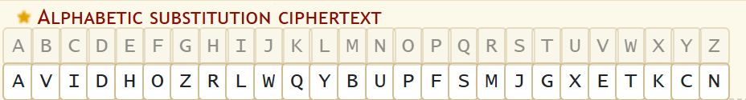

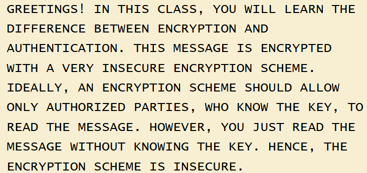

**3. Breaking the Vigenere Cipher**

- The `Cyphertext`:

```
TWT CMGWI ZJTWT AIOEAP XO QT DICJGP MN IWPMR ETCWOCH, SSUHTD, TAETCW, ACS PJFTREW, AVPTRSI JYVEPHZRAQAP WEPGNLEH PYH STXKYRTH, DLAAA YST QTGMOAPEID, PCO RO LPCVACID WHPAW MSHJP,FUI JASN EGZFAQAP GAJHP, WUEEZVTTS MC OPIS SR PUQMRBPEMOC, PYH PPGEMCJALVLN SPWCGXMMNV ISI PAPNI TD QP WEPGNLES, PYH TWT AIRHDYW OG ISMNVH ES BT HPMZTS.
```

- Use the tool [Dcode](https://www.dcode.fr/vigenere-cipher) to find the `Key` and the `plaintext`.

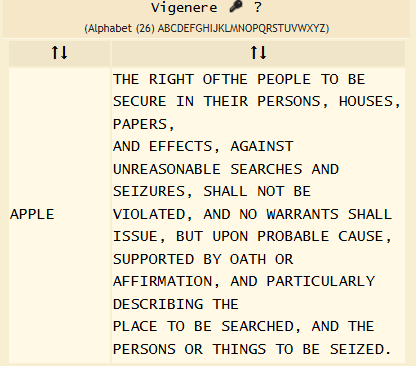

- The `Key` is `APPLE` and the `plaintext` is:

```
THE RIGHT OFTHE PEOPLE TO BE SECURE IN THEIR PERSONS, HOUSES, PAPERS,
AND EFFECTS, AGAINST UNREASONABLE SEARCHES AND SEIZURES, SHALL NOT BE
VIOLATED, AND NO WARRANTS SHALL ISSUE, BUT UPON PROBABLE CAUSE,
SUPPORTED BY OATH OR AFFIRMATION, AND PARTICULARLY DESCRIBING THE
PLACE TO BE SEARCHED, AND THE PERSONS OR THINGS TO BE SEIZED.
```

**4. MD5 Collisions**

- Message 1, I store it in `mes1` file:

```
d131dd02c5e6eec4693d9a0698aff95c2fcab58712467eab4004583eb8fb7f8955ad340609f4b30283e488832571415a085125e8f7cdc99fd91dbdf280373c5bd8823e3156348f5bae6dacd436c919c6dd53e2b487da03fd02396306d248cda0e99f33420f577ee8ce54b67080a80d1ec69821bcb6a8839396f9652b6ff72a70
```

- Message 2, I store it in `mes2` file:

```
d131dd02c5e6eec4693d9a0698aff95c2fcab50712467eab4004583eb8fb7f8955ad340609f4b30283e4888325f1415a085125e8f7cdc99fd91dbd7280373c5bd8823e3156348f5bae6dacd436c919c6dd53e23487da03fd02396306d248cda0e99f33420f577ee8ce54b67080280d1ec69821bcb6a8839396f965ab6ff72a70
```

- Convert each group of hex strings into a binary file.

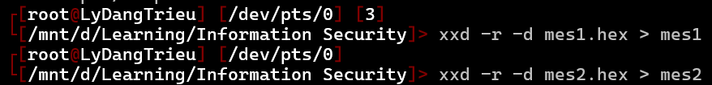

- Use the command `openssl dgst -md5` to display the `MD5 hashes` of each file.

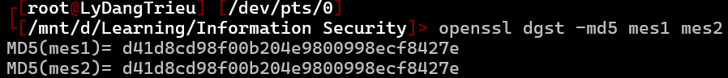

- Because **the hashes are the same**, it `confirms` that **the binary files are the same**.

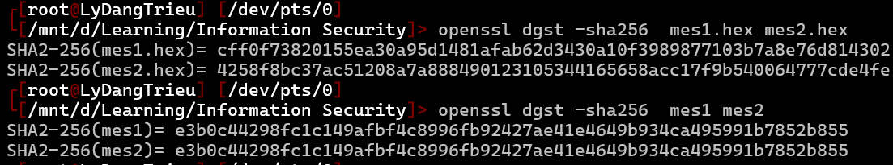

- ???

# Lab B: Crypto-Lab: – Exploring Collision-Resistance, Pre-Image Resistance and MACs

# Task 2:

**a. Create a text file of any length.**

**b. Generate the hash value H1 for this file using a specific hash algorithm.**

- Use `md5` to encrypt file

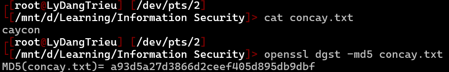

**c. Flip one bit of the input file. You can achieve this modification using Bless.**

- Use `Bless` to edit one bit

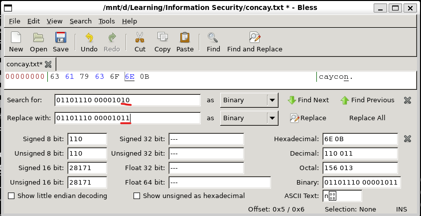

**d. Generate the hash value H2 for the modified file.**

- Hash text file again

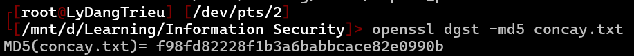

**e. Observe whether H1 and H2 are similar or not. Write a short program to count how many bits are different between H1 and H2.**

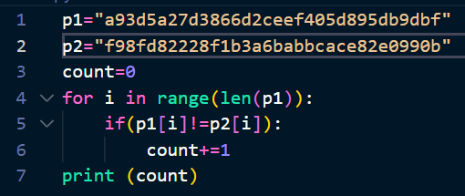

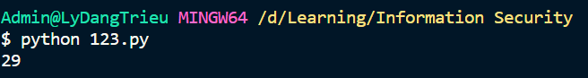
