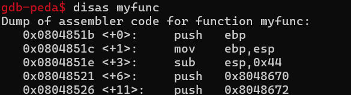
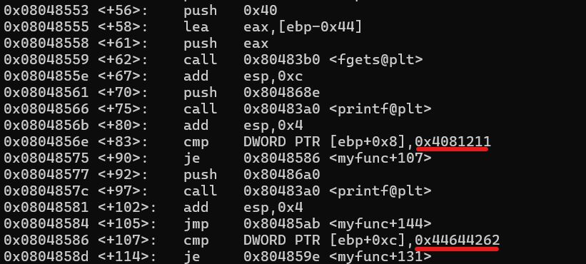
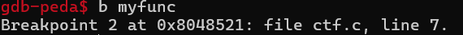
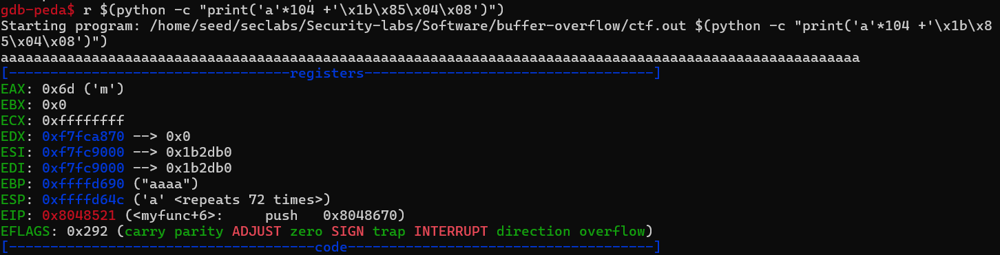
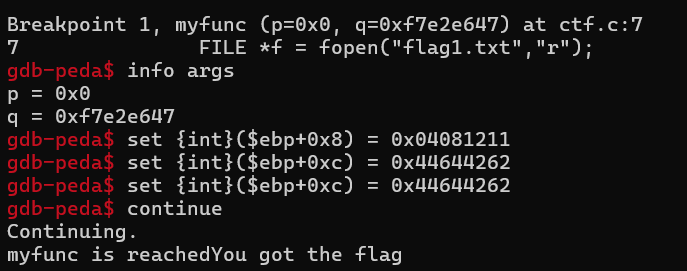

# CTF LAB

**stack frame of ctf.c**

- To transfer control from the `vuln` function to the `myfunc` function, you need to overwrite the address of the `myfucn` function on the `Return Address` of the `vuln` function.

- Create flie `flag1.txt`

- Go to `gdb` to get the function address `myfunc`, the address is `0x0804851b`

- The two addresses highlighted will be read and assigned values ​​to the two arguments `p` and `q` of the `myfuc` function respectively.We will set a breakpoint before the program checks p and q to set their values ​​to `0x4081211` and `0x44644262` respectively.

- Run the program with the command `r $(python -c "print('a'*104 +'\x1b\x85\x04\x08')")`to transfer control to `myfunc`. Then set at position `[ebp+8]=0x04081211` and `[ebp+12]=0x44644262` to set the values ​​for $p$ and $q$. We complete the math requirements

