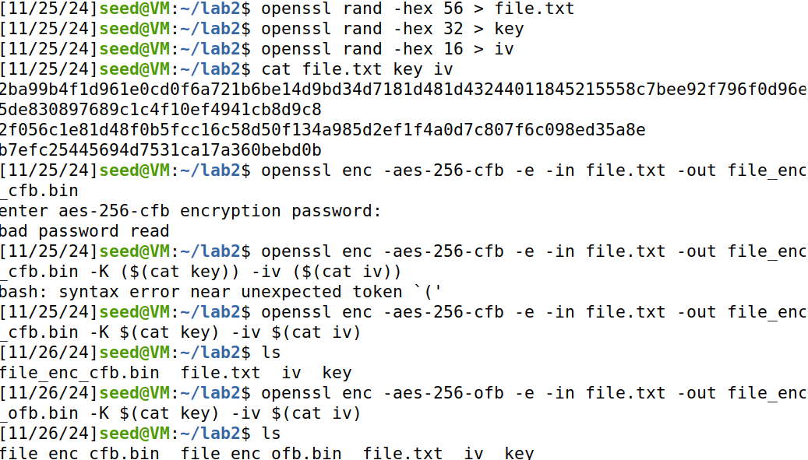

## LAB 2: FILE TRANSFER AND ENCRYTION

# Student

- Student name: Ly Dang Trieu.

- Student ID: 22110080.

- Couse: INSE33030E_02FIE.

# Lab enviroment

- I have two **Virtual Machines**, one is `Kali` and the other is `Ubuntu`. The ip address of `kali` is `10.111.6.7`, the ip address of `Ubuntu` is `10.111.6.8`.


# Task 1: Public-key based authentication

**Question 1**:
Implement public-key based authentication step-by-step with openssl according the following scheme.


**Answer 1**:

- I use `ubuntu as the server` and `kali as the client` in above scheme.

- At client, I create an RSA key pair consisting of a public key and a private key for the client by using two command below:

```
openssl genrsa -out client_private.pem 2048
openssl rsa -in client_private.pem -pubout -out client_public.pem
```


- Next, I send the `public key` to server. The server has received the public key.


- Now at server, I create text file. Then I encrypt `file.txt` with `client_public key`


- Next, the server then sends back the encrypted packet, and the client decrypts it using the private key.


- The client uses its private key to sign the `file_decrypted`. The client sends `file_signature.bin` back to the server.


- The server uses the client's public key to verify the `file_signature.bin`.


- The returned result is `Verified OK`, the authentication process is `successful`.

# Task 2: Encrypting large message

Create a text file at least 56 bytes.

**Question 1**:

Encrypt the file with aes-256 cipher in CFB and OFB modes. How do you evaluate both cipher as far as error propagation and adjacent plaintext blocks are concerned.

**Answer 1**:


**1. Cipher Feedback Mode Encryption (CFB)**

- Initialization Vector (IV): A random initialization value used to start the encryption process. The IV is encrypted using the block cipher algorithm along with the secret key.

- XOR: The result of the IV is XORed with the plaintext to generate the ciphertext.

- Iterative Process: The ciphertext is used as the input for the next encryption step, replacing the IV.

- Step-by-step process:

  1. Encrypt the IV using the secret key.

  2. XOR the output of step 1 with the plaintext to generate the ciphertext.

  3. Shift the ciphertext to become the input for the next step (shift feedback).

**2. Cipher Feedback Mode Decryption (CFB)**

- The decryption process is the reverse of encryption but uses the same block cipher algorithm.

- The ciphertext from the previous step is encrypted using the secret key and XORed with the current ciphertext to recover the plaintext.

- Step-by-step process:

  1. Encrypt the ciphertext (or IV for the first step) using the secret key.

  2. XOR the output of step 1 with the ciphertext to recover the plaintext.

  3. Shift the current ciphertext forward to process the next block.

**Output Feedback Mode (OFB)**


**1. OFB (Output Feedback Mode) Encryption**

- Initialization (Initialization Vector - IV): A random initialization value is used as the initial input. The IV is encrypted using the block cipher algorithm along with the secret key.

- Iterative Process:

  - The output of the encryption algorithm is directly used as the input for the next encryption step.

  - This output is XORed with the plaintext to generate the ciphertext.

- Step-by-step process:

  1. Encrypt the IV using the secret key to generate a "keystream."

  2. XOR the keystream with the plaintext to generate the ciphertext.

  3. Use the output of the block encryption as the input for the next encryption step.

**2. OFB (Output Feedback Mode) Decryption**

- The decryption process in OFB is almost identical to encryption. This is because the output of the encryption algorithm depends only on the IV and the secret key, not on the ciphertext.

- XORing the keystream with the ciphertext recovers the plaintext.

- Step-by-step process:

  1. Start with the same IV as used during encryption and encrypt it to generate the keystream.

  2. XOR the keystream with the ciphertext to recover the plaintext.

  3. The output of the encryption algorithm continues to be used as the input for subsequent steps.

**Encrypt the file with aes-256 cipher in CFB and OFB modes**

- In AES-256, the sizes of the key and IV are defined as follows:

  - Key: `32 bytes`.

  - IV: `16 bytes` equal to `1 block`, with a fixed size for all AES modes of operation.



**Evaluation Based on Error Propagation and Impact on Adjacent Plaintext Blocks:**

- CFB:

  - When an error occurs during transmission (or storage), it propagates to a few adjacent blocks. This happens because CFB relies on the XOR of the plaintext and the encrypted output of the previous block.

  - The impact of errors is usually limited to a small number of blocks, often determined by the block size.

- OFB:

  - Unlike CFB, OFB does not use the encrypted output of the previous block to generate the keystream. Instead, it relies only on the initialization vector (IV) and the key.

  - Therefore, any error in transmission does not propagate to other blocks.

**Question 2**:
Modify the 8th byte of encrypted file in both modes (this emulates corrupted ciphertext).
Decrypt corrupted file, watch the result and give your comment on Chaining dependencies and Error propagation criteria.

**Answer 2**:

- I use `Bless` to modify the 8th byte of encrypt file in both mode.

- Change `77` to `F0` in file `enc_cfb.bin`


- Change `77` to `A0` in file `enc_ofb.bin`


- Decrypt two file and watch the result.


**Comments on the Corrupted Part:**

- AES-256-CFB:

  - After modifying the 8th byte in the ciphertext, the decrypted result shows errors starting from the modified byte onward in the plaintext.

  - This is because the CFB mode uses the output from the previous block to generate the keystream for the next block. A change in the ciphertext at any position affects the corresponding plaintext and all subsequent bytes.

- AES-256-OFB:

  - The decryption result has only one corrupted byte at the position corresponding to the modified byte in the ciphertext.

  - The OFB mode generates a keystream independently of the ciphertext, so modifying a single byte in the ciphertext only affects the corresponding byte in the plaintext.
